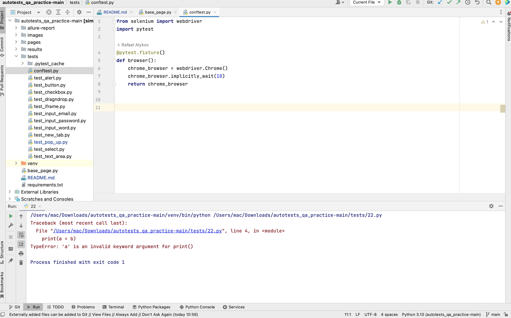
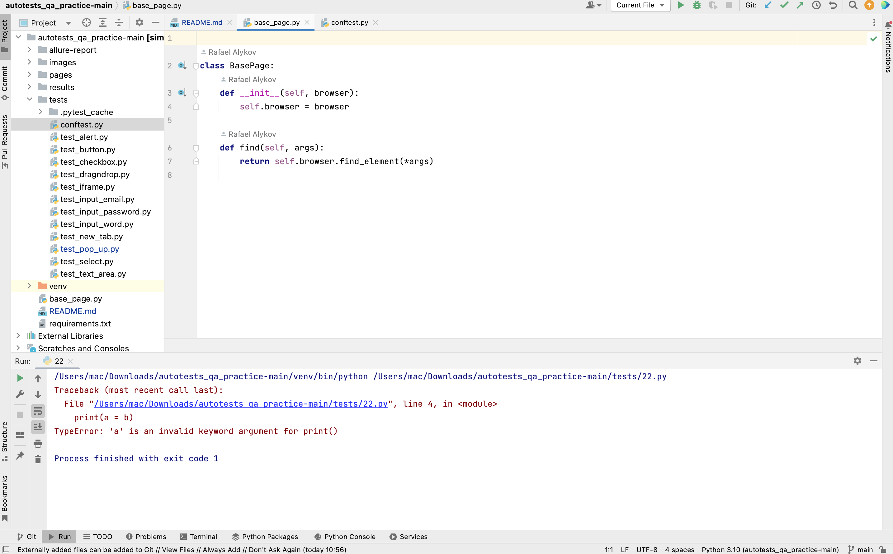
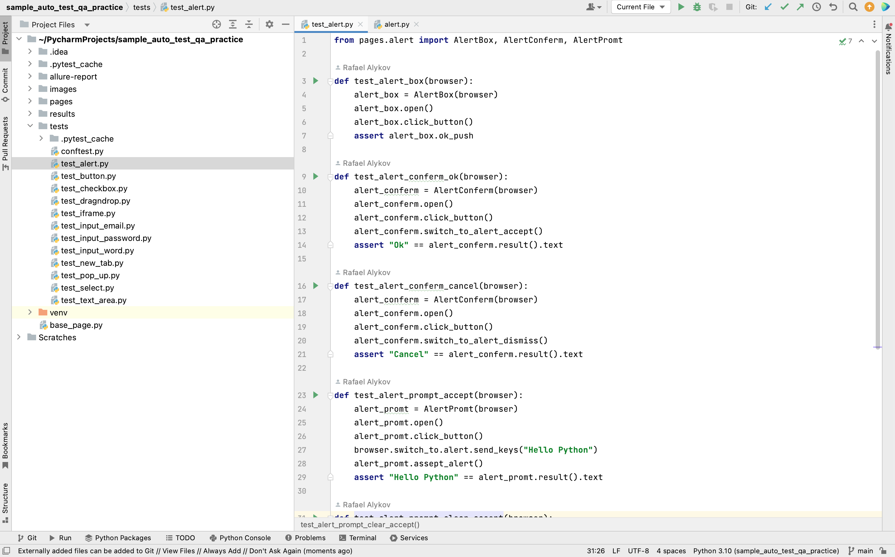
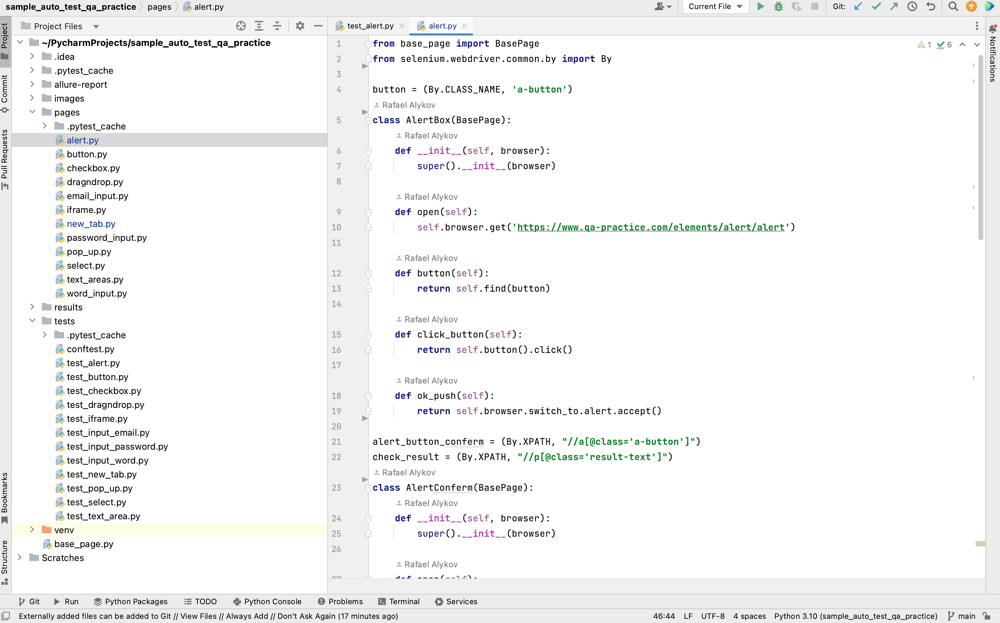
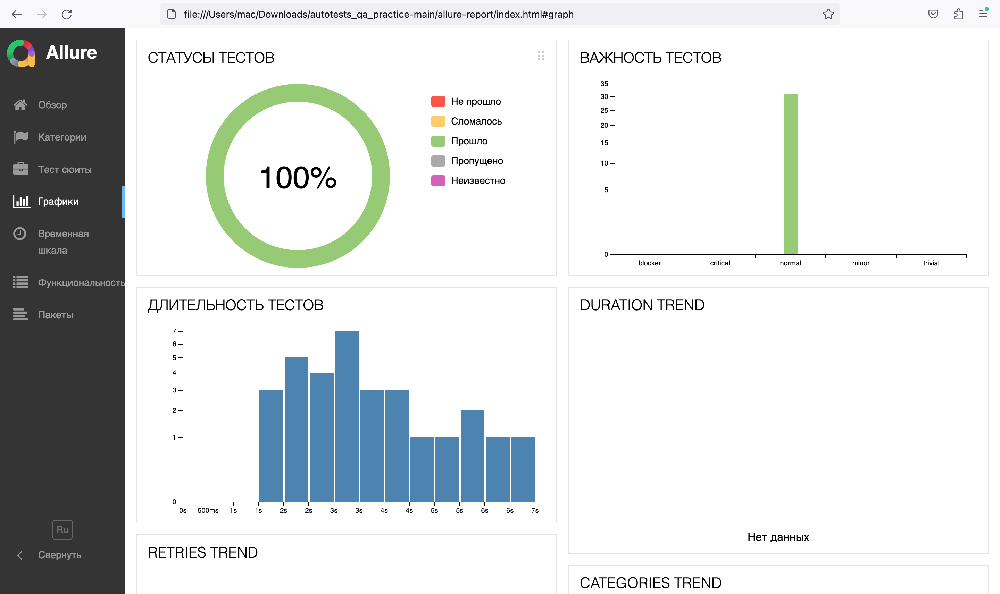
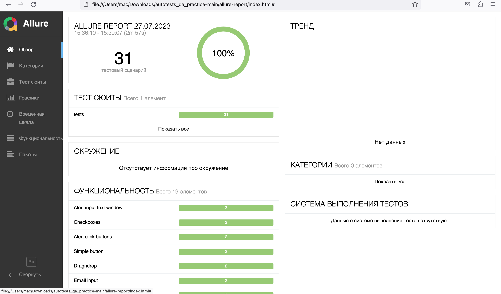
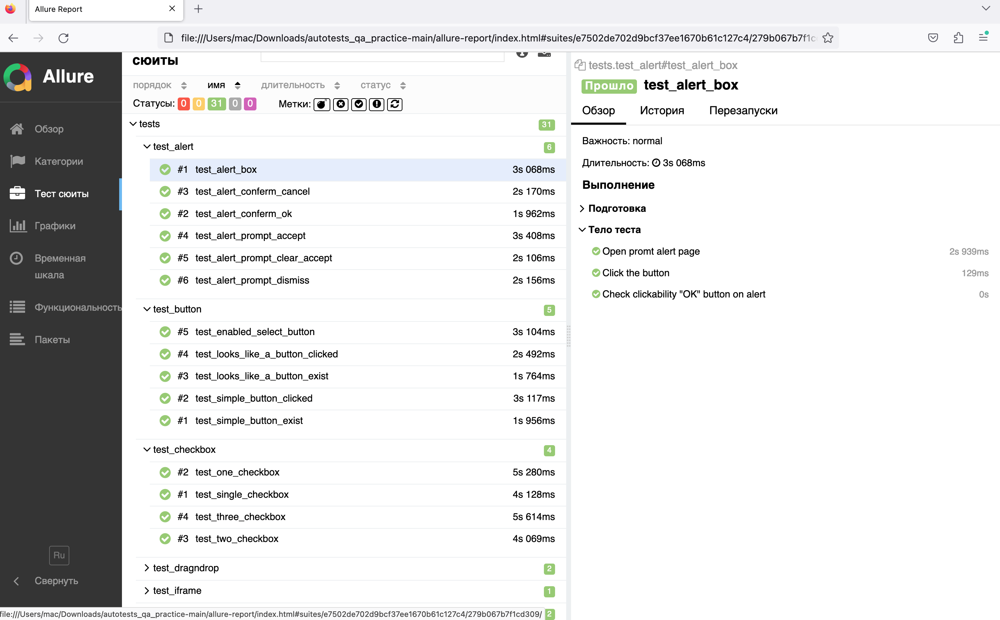
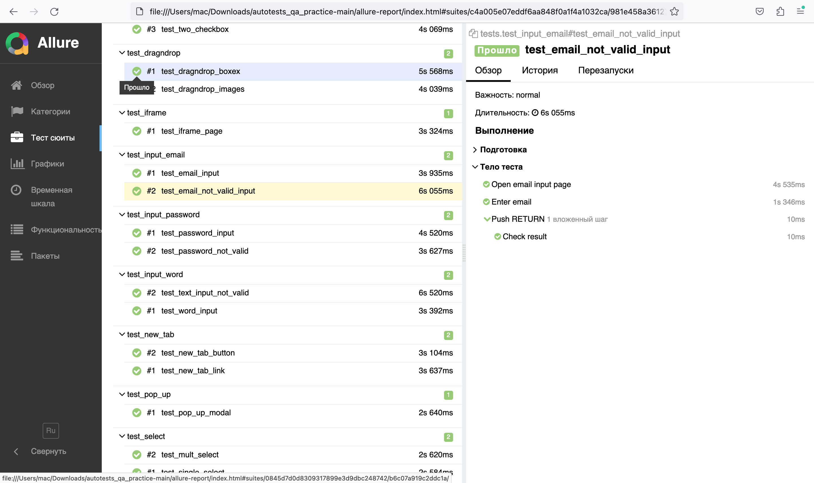

# Проект UI автотестов qa-practice.com  

 

### Технологии

  <code></code>
  <code></code>
  <code></code>
  <code></code>
  <code></code>
  <code></code>

### Тестируем

* Ввод email, password, тексты
* Нажатие кнопок
* Выбор чекбоксов
* Айфреймы
* Драгндроп
* Окна уведомления
* Открытин новых окон
* Выбор селектов

___

##### Создем файл conftest.py, куда импортируем Selenium и Pytest и создаем фикстуру с вызовом chromedrive.

  <code></code>

##### Также создем basepage.py, обозначаем класс BasePage для вызова функций.

  <code></code>

##### Пишем тесты к каждой функциональности сайта и создаем классы в папке pages, для вызова функций поиска, клика и др.

  <code></code>
  <code></code>

##### После тестов, результаты можно увидеть в Allure отчете

  <code></code>
  <code></code>
  <code></code>
  <code></code>

